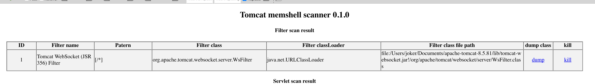
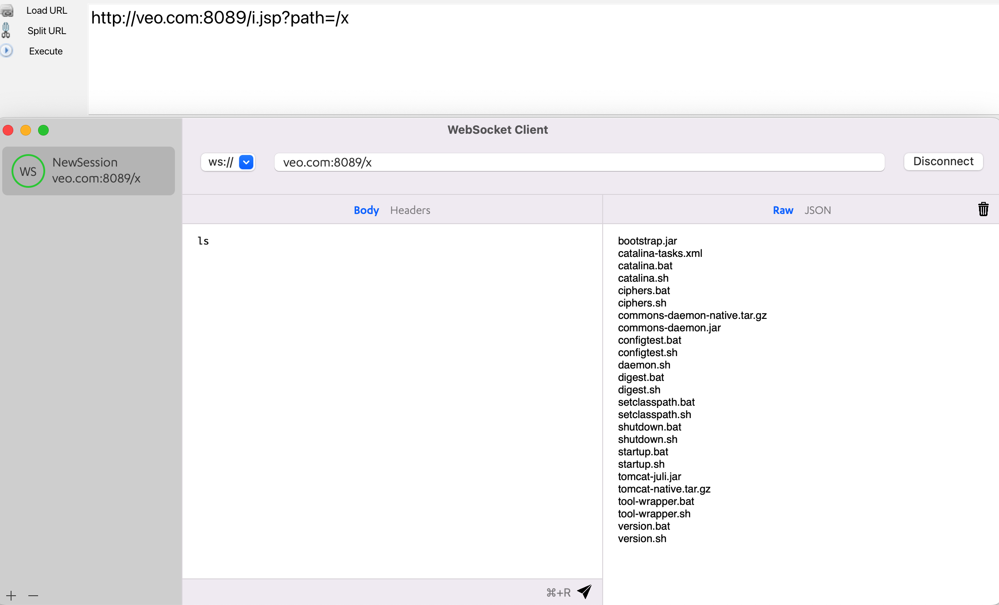
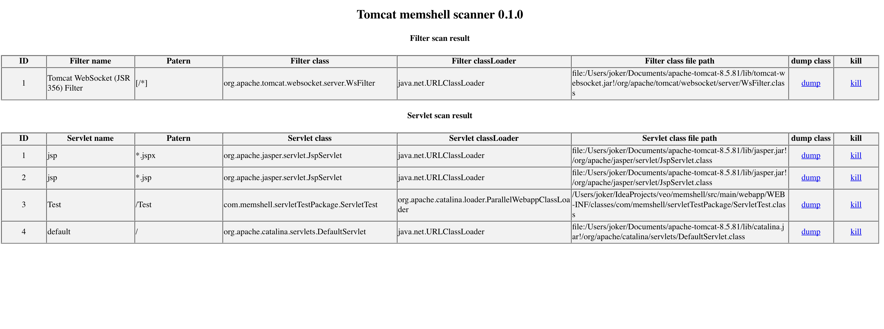
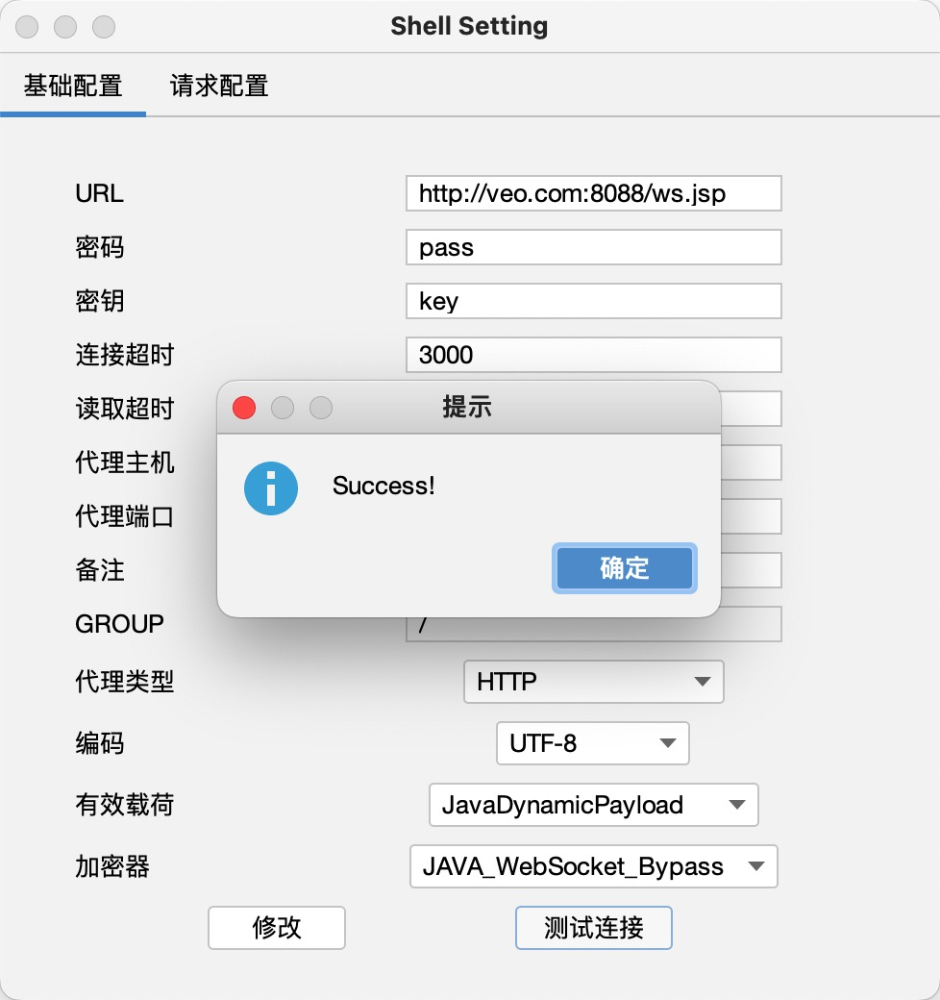

### [wsMemShell](https://github.com/veo/wsMemShell)
Author: veo


# **WebSocket 内存马，一种新型内存马技术**

### 0.兼容性测试

目前测试过 Tomcat Spring Jetty 都可以正常使用

WebLogic 比较特殊有条件，详情见 WebLogic 目录和文件内的注释

Jboss(WildFly) 未进行测试

### 1.前言

WebSocket是一种全双工通信协议，即客户端可以向服务端发送请求，服务端也可以主动向客户端推送数据。这样的特点，使得它在一些实时性要求比较高的场景效果斐然（比如微信朋友圈实时通知、在线协同编辑等）。主流浏览器以及一些常见服务端通信框架（Tomcat、netty、undertow、webLogic等）都对WebSocket进行了技术支持。

### 2.版本

2013年以前还没出JSR356标准，Tomcat就对Websocket做了支持，自定义API，再后来有了JSR356，Tomcat立马紧跟潮流，废弃自定义的API，实现JSR356那一套，这就使得在Tomcat7.0.47之后的版本和之前的版本实现方式并不一样，接入方式也改变了。

JSR356 是java制定的websocket编程规范，属于Java EE 7 的一部分，所以要实现websocket内存马并不需要任何第三方依赖

### 3.服务端实现方式

#### （1）注解方式

```
@ServerEndpoint(value = "/ws/{userId}", encoders = {MessageEncoder.class}, decoders = {MessageDecoder.class}, configurator = MyServerConfigurator.class)
```

Tomcat在启动时会默认通过 WsSci 内的 ServletContainerInitializer 初始化 Listener 和 servlet。然后再扫描 `classpath`下带有 `@ServerEndpoint`注解的类进行 `addEndpoint`加入websocket服务

所以即使 Tomcat 没有扫描到 `@ServerEndpoint`注解的类，也会进行Listener和 servlet注册，这就是为什么所有Tomcat启动都能在memshell scanner内看到WsFilter



#### （2）继承抽象类Endpoint方式

继承抽象类 `Endpoint`方式比加注解 `@ServerEndpoint`方式更麻烦，主要是需要自己实现 `MessageHandler`和 `ServerApplicationConfig`。`@ServerEndpoint`的话都是使用默认的，原理上差不多，只是注解更自动化，更简洁

可以用代码更方便的控制 ServerEndpointConfig 内的属性

```
ServerEndpointConfig serverEndpointConfig = ServerEndpointConfig.Builder.create(WebSocketServerEndpoint3.class, "/ws/{userId}").decoders(decoderList).encoders(encoderList).configurator(new MyServerConfigurator()).build();
```

### 3.websocket内存马实现方法

之前提到过 Tomcat 在启动时会默认通过 WsSci 内的 ServletContainerInitializer 初始化 Listener 和 servlet。然后再扫描 `classpath`下带有 `@ServerEndpoint`注解的类进行 `addEndpoint`加入websocket服务

那如果在服务启动后我们再 addEndpoint 加入websocket服务行不行呢？答案是肯定的，而且非常简单只需要三步。创建一个ServerEndpointConfig，获取ws ServerContainer，加入 ServerEndpointConfig，即可

```
ServerEndpointConfig config = ServerEndpointConfig.Builder.create(EndpointInject.class, "/ws").build();
ServerContainer container = (ServerContainer) req.getServletContext().getAttribute(ServerContainer.class.getName());
container.addEndpoint(config);
```

### 4.效果

首先利用i.jsp注入一个websocket服务，路径为/x，注入后利用ws连接即可执行命令



且通过memshell scanner查询不到任何异常（因为根本就没注册新的 Listener、servlet 或者 Filter）



### 5.代理

WebSocket是一种全双工通信协议，它可以用来做代理，且速度和普通的TCP代理一样快，这也是我研究websocket内存马的原因。

例如有一台不出网主机，有反序列化漏洞。

以前在这种场景下，可能会考虑上reGeorg或者利用端口复用来搭建代理。

现在可以利用反序列化漏洞直接注入websocket代理内存马，然后直接连上用上全双工通信协议的代理。

注入完内存马以后，使用 Gost：[https://github.com/go-gost/gost](https://github.com/go-gost/gost) 连接代理

```
./gost -L "socks5://:1080" -F "ws://127.0.0.1:8080?path=/proxy"
```
然后连接本地1080端口socks5即可使用代理

### 6.多功能shell实现

想要使用ws马首先得支持连接ws协议的工具，目前市面的webshell管理工具都要从源码上修改才能支持ws协议

（内容更新 ：蚁剑v2.1.15已更新支持）


具体实现过程也并不复杂，相当于只是替换了协议，内容其实可以不变。例如给出的哥斯拉支持样例，基本逻辑并没发生改变，只是协议变了

还有一个问题是ws马必须先注入再连接，并不能直接连接jsp马。

然而例如哥斯拉的jsp马本身就是支持远程代码执行，那么jsp马其实可以保持不变就用哥斯拉原版，但发送class要修改，先发送过去先初始化注册ws马的class，连上ws以后再初始化恶意class，多一步，第二步连接的时候使用ws连接。

如果是内存注入的webshell，则直接使用ws协议连接

</a> </a>


## 版权声明
完整代码：[https://github.com/veo/wsMemShell](https://github.com/veo/wsMemShell) 

本文章著作权归作者所有。转载请注明出处！[https://github.com/veo](https://github.com/veo)
